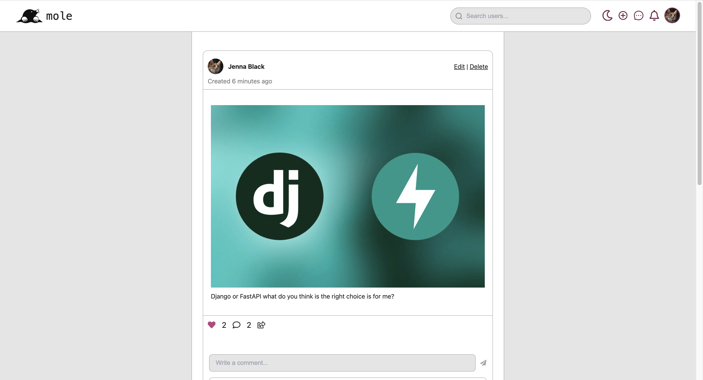
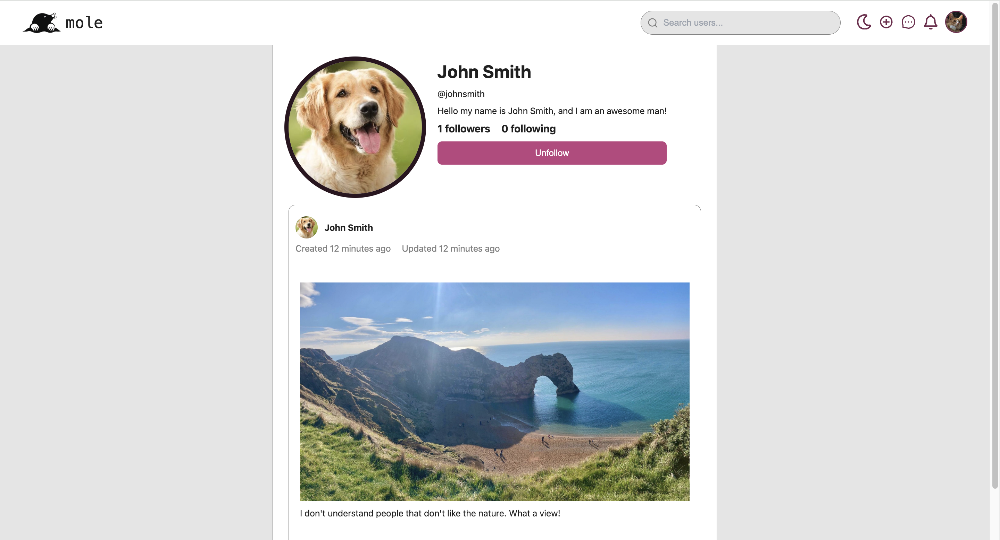
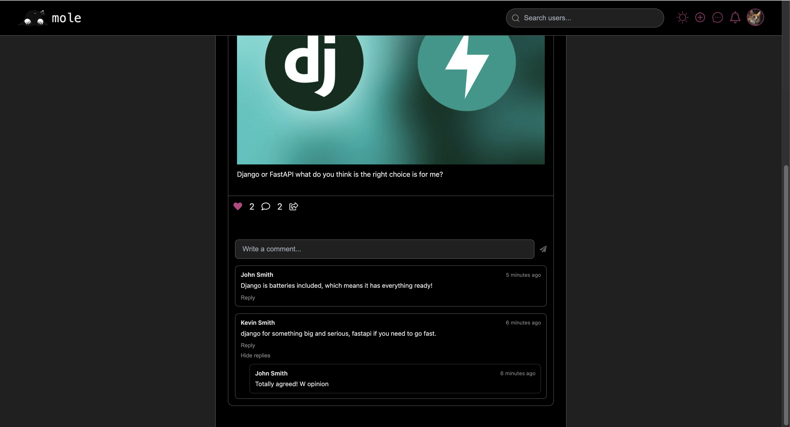

# Mole

A full-stack social media platform built with Next.js, Django REST Framework, PostgreSQL, and JWT authentication.

## ✨ Features

- User authentication
- Light/Dark themes
- Create posts
- Like posts
- Comments and replies
- Infinite scrolling feed
- User profiles
- Messaging (Coming soon)
- Real-time notifications (Coming soon)
- Polls (Coming soon)
- Image filters (Coming soon)
- Email verification and OAuth (Coming soon)

## ⚙️ Requirements

* [🐍 Python](https://www.python.org/)
* [🪐 uv package manager](https://docs.astral.sh/uv/)
* [🐘 PostgreSQL](https://www.postgresql.org/)
* [⬢ Node.js and npm](https://nodejs.org/en)

## 🛠️ Tech Stack

Frontend:
- Next.js
- TypeScript
- Vanilla CSS

Backend:
- Django
- Django REST Framework
- PostgreSQL
- SimpleJWT

## 📷 Screenshots

### Home Feed


### User Profile


### Comment section


## 🚀 Installation

### 1. Clone this repository

```shell
git clone https://github.com/ArtashesSoghomonyan/mole.git
```

### 2. Install the packages

```shell
cd mole/backend
uv venv
source .venv/bin/activate
uv sync
cd ../frontend
npm install
```

### 3. Create the environment variables

```shell
cd mole/backend
cp .env.example .env
cd ../frontend
cp .env.local.example .env.local
```

### 4. Create a database in Postgres shell

```sql
CREATE USER moleuser WITH PASSWORD 'password1234!';
CREATE DATABASE mole OWNER moleuser;
GRANT ALL PRIVILEGES ON DATABASE mole TO moleuser;
```

### 5. Run migrations and run the project

* Inside mole/backend run
  ```shell
  source .venv/bin/activate
  uv run manage.py migrate
  uv run manage.py runserver
  ```

* Inside mole/frontend run
  ```shell
  npm run dev
  ```

## 🧑‍💻 API Documentation

The api documentation is available via Swagger and drf-spectacular.
